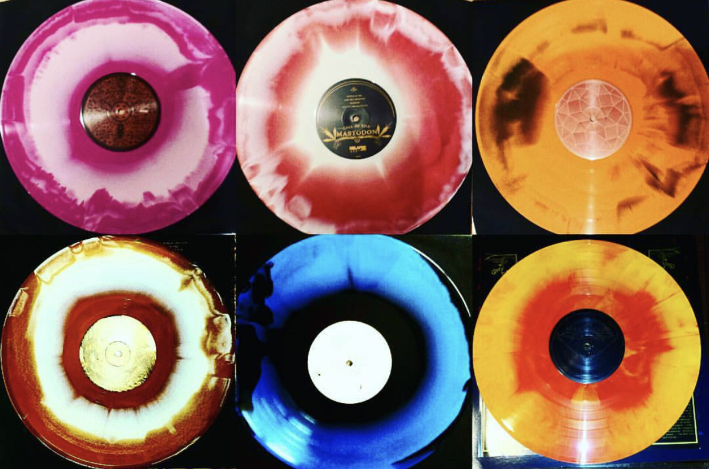

# My Discogs Collection - Analytics

For every vinyl and CD I purchased, I recorded them on Discogs with the price I paid and if it was autographed. The data has
interesting information such as the value of the records, price, genre (I manually entered them), record label, and year it was
released.

### Table of Contents

1. [Project Motivation](#motivation)
2. [Installation](#installation)
3. [File Descriptions](#files)
4. [Results](#results)
5. [Resources](#resources)
6. [Licensing, Authors, and Acknowledgements](#licensing)

## Project Motivation<a name="motivation"></a>

I want to understand my record collection better by looking at the value, cost, and genres I am into.
I also want to improve my Python skills and perhaps build a package/functions to analyze Discogs data efficiently.

## Installation <a name="installation"></a>

### Virtual environment
Add the following to your .bash_profile to source virtualenv correctly:

```
export WORKON_HOME=$HOME/.virtualenvs
export VIRTUALENVWRAPPER_PYTHON=/usr/local/bin/python3
export VIRTUALENVWRAPPER_VIRTUALENV=/usr/local/bin/virtualenv
source /usr/local/bin/virtualenvwrapper.sh
```
Create a virtual environment:
```
mkvirtualenv discogs --no-site-packages
workon discogs
add2virtualenv .
```

### Python packages:
```
pip3 install -r requirements.txt
```

### Jupyter notebook (if needed):
```
python3 -m ipykernel install --user --name discogs --display-name "discogs"
```

## File Descriptions <a name="files"></a>
*There is one notebook called `discogs_analysis.ipynb` that runs the exploratory data analysis.

## Results<a name="results"></a>

## Resources<a name="resources"></a>

[Building structured multi-plot grids](https://seaborn.pydata.org/tutorial/axis_grids.html)

[Visualizing linear relationships](https://seaborn.pydata.org/tutorial/regression.html)

[Visualizing the distribution of a dataset](https://seaborn.pydata.org/tutorial/distributions.html#plotting-bivariate-distributions)

[Plotting with categorical data](http://seaborn.pydata.org/tutorial/categorical.html)


## Licensing, Authors, Acknowledgements<a name="licensing"></a>

Inspiration on EDA

[Exploratory Data Analysis: Iris Flower Dataset](https://medium.com/analytics-vidhya/exploratory-data-analysis-iris-flower-dataset-a21c368a1f4)

[A Starter Pack to Exploratory Data Analysis with Python, pandas, seaborn, and scikit-learn](https://towardsdatascience.com/a-starter-pack-to-exploratory-data-analysis-with-python-pandas-seaborn-and-scikit-learn-a77889485baf)


Future links to explore

[discogs-xml2db](https://github.com/philipmat/discogs-xml2db)

[autoEDA-resources](https://github.com/mstaniak/autoEDA-resources)

[Discogs Developer](https://www.discogs.com/developers/#page:home,header:home-quickstart)

[Download Discogs Data](https://data.discogs.com/)

[Discogs Database Search](https://www.discogs.com/developers/#page:database,header:database-search)

[Discogs Oauth](https://github.com/jesseward/discogs-oauth-example)

Feel free to use my notebook and explore my analysis!

## Authors

**Hasib Neaz** - *Initial work* - [hneaz](https://github.com/hneaz)

