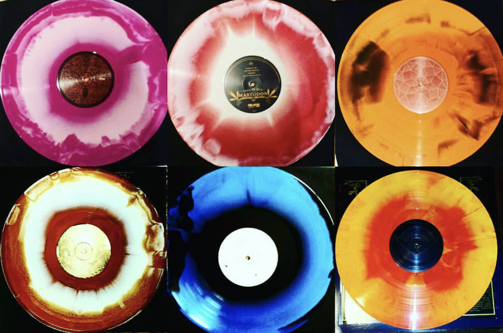
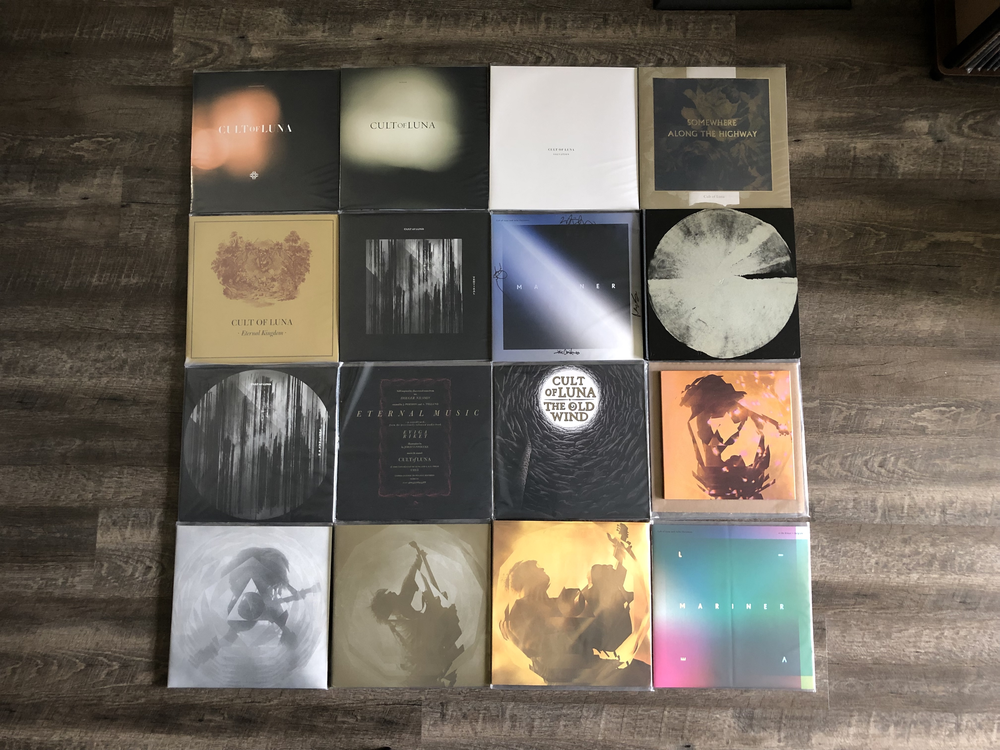

# My Discogs Collection - Analytics

For every vinyl and CD I purchased, I recorded them on Discogs with the price I paid and if it was autographed. The data has
interesting information such as the value of the records, price, genre (I manually entered them), record label, and year it was
released.

### Table of Contents

1. [Project Motivation](#motivation)
2. [Installation](#installation)
3. [File Descriptions](#files)
4. [Results](#results)
5. [Resources](#resources)
6. [Licensing, Authors, and Acknowledgements](#licensing)

## Project Motivation<a name="motivation"></a>

I want to understand my record collection better by looking at the value, cost, and genres I am into.
I also want to improve my Python skills and perhaps build a package/functions to analyze Discogs data efficiently.

## Installation <a name="installation"></a>

### Virtual environment (zsh)

# 1. Initialize empty project
```
uv init --bare
```

# 2. Import main dependencies
```
uv add -r requirements.txt
```

# 3. Install jupyterlabs
```
uv tool install juv
```

```
uv add --dev ipykernel
uv add --dev jupyterlab
```

# 4. Sync the environment
```
uv sync
```

# 5. Jupyter notebook (if needed):
```
uv run jupyter lab   
```

## File Descriptions <a name="files"></a>
*There is one notebook called `discogs_analysis.ipynb` that runs the exploratory data analysis.

## Results<a name="results"></a>

### Key Sections

**1. Data Loading and Cleaning**
- Loaded raw Discogs collection data from `data/discogs_data.csv`
- Split multi-label columns into separate columns (Label1, Label2, Label3, Label4)
- Dropped unused columns: Rating, Collection Media Condition, Collection Notes, Collection Sleeve Condition
- Filled missing autograph status with 'No'
- Created composite "Record" column (Artist - Title)
- Exported cleaned dataset to `output/discogs_clean_data.csv`

**2. Collection Profile Summary**
- **Total purchases**: ~408 albums in vinyl, CD, and tape formats
- **Unique artists**: 188 (including 10 collaborations)
- **Distinct albums**: 388
- **Top 5 artists**: Opeth (19), Cult Of Luna (16), Isis (12), Panopticon (11), Between The Buried And Me (10)
- **Format breakdown**: 84.3% vinyl, 15.4% CD, 2 tapes
- **Genre distribution**: Metal (87.7%), Rock (7.6%), Electronic (2.9%), Pop (0.7%), Hip Hop (0.5%)
- **Subgenre distribution**: Black Metal (20.3%), Progressive Metal (15.2%), Post Metal (15.0%), Djent (6.4%), Sludge Metal (6.4%)
- **Average purchase price**: ~$15 (50 records at $15, 49 at $20)

**3. Most/Least Expensive Records**
- **Most expensive**: Meshuggah - "25 Years Of Musical Deviance" Boxset (bought for $232, median value $514.17)
- **Least expensive (owned)**: Received Wyclef Jean 2xLP for free
- **Least expensive (purchased)**: Wyclef Jean 2xLP for $0.50 at Dusty Groove basement

**4. Top 10 Most Expensive Records by Collection Folder**
- Grouped spending and value analysis by collection folder
- Identified highest-value items within each folder for focused collection building

**5. Top Artists by Total Spending**
- Aggregated total cost, count, unique labels per artist
- Identified which artists represent the largest portion of collection investment
- Visualized spending distribution across top 10 most expensive artists

**6. Record Label Analysis**
- Analyzed spending and value by record label
- Top labels by count: Relapse Records (23), Century Media (17), Prosthetic Records (13), Hydra Head Records (12), 20 Buck Spin (10)
- Identified labels where collection was spent the most

**7. Time Series Analysis**
- Tracked collection additions over time (Date_Added)
- Analyzed spending trends by year of release
- Identified acquisition patterns and release year distributions
- Top release years: 2014 (61), 2013 (55), 2016 (52), 2015 (48), 2017 (40)

**8. Format Analysis**
- Compared vinyl, CD, and tape formats
- Analyzed distribution of costs, min, median, and max prices by format
- Excluded tapes from primary analysis (separate category)

**9. Autographed Records Analysis**
- Filtered autographed vs non-autographed records
- Created distribution plots comparing value by autograph status
- Identified if autographed items command premium pricing

**10. Genre Analysis**
- Boxplots comparing Collection_Cost, Min, Median, Max by genre
- Pairplots showing relationships between cost metrics and genre
- Distribution plots per genre to understand price clustering

**11. Subgenre Analysis**
- Detailed breakdown by subgenre (Black Metal, Progressive Metal, Post Metal, etc.)
- 3D scatter plots visualizing Collection_Cost vs Median vs Max by subgenre
- Cumulative sum animations showing acquisition patterns over years
- Reduced dataset filters applied (Collection_Cost < $200) for cleaner visualization

**12. Animation Visualizations**
- Created animated bar charts using Plotly for time-series exploration
- Year-by-year breakdown of title counts, costs, and values
- Subgenre evolution animations showing collection growth patterns
- Scatter animations correlating cost metrics across years

**13. Data Export for Visualization**
- Exported cumulative sum data to `output/discogs_cum_sum_data.csv` for Flourish visualization
- Prepared pivot tables for heatmap generation

### Financial Summary
- **Total spent**: Sum of Collection_Cost across all records
- **Total median value**: Sum of _Median_ across all records
- **Average spent per record**: Mean of Collection_Cost
- **Average collection value**: Mean of _Median_
- **Profit margin analysis**: Comparison of purchase price vs market value by metric (Min, Median, Max)

## Resources<a name="resources"></a>

[Building structured multi-plot grids](https://seaborn.pydata.org/tutorial/axis_grids.html)

[Visualizing linear relationships](https://seaborn.pydata.org/tutorial/regression.html)

[Visualizing the distribution of a dataset](https://seaborn.pydata.org/tutorial/distributions.html#plotting-bivariate-distributions)

[Plotting with categorical data](http://seaborn.pydata.org/tutorial/categorical.html)


## Licensing, Authors, Acknowledgements<a name="licensing"></a>

Inspiration on EDA

[Exploratory Data Analysis: Iris Flower Dataset](https://medium.com/analytics-vidhya/exploratory-data-analysis-iris-flower-dataset-a21c368a1f4)

[A Starter Pack to Exploratory Data Analysis with Python, pandas, seaborn, and scikit-learn](https://towardsdatascience.com/a-starter-pack-to-exploratory-data-analysis-with-python-pandas-seaborn-and-scikit-learn-a77889485baf)


Future links to explore

[discogs-xml2db](https://github.com/philipmat/discogs-xml2db)

[autoEDA-resources](https://github.com/mstaniak/autoEDA-resources)

[Discogs Developer](https://www.discogs.com/developers/#page:home,header:home-quickstart)

[Download Discogs Data](https://data.discogs.com/)

[Discogs Database Search](https://www.discogs.com/developers/#page:database,header:database-search)

[Discogs Oauth](https://github.com/jesseward/discogs-oauth-example)

Feel free to use my notebook and explore my analysis!

## Authors

**Hasib Neaz** - *Initial work* - [hneaz](https://github.com/hneaz)

